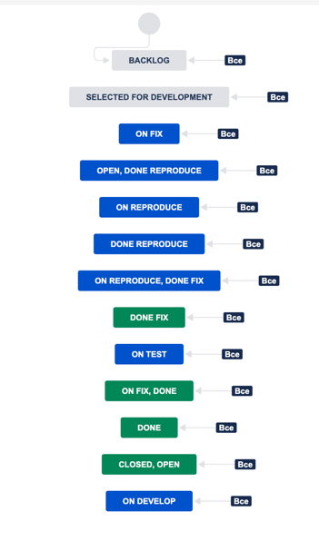

```xml

<!-- 
RSS generated by JIRA (1001.0.0-SNAPSHOT#100225-sha1:85acc52e3f11118ec729efdad7734bf1fac1ae52) at Sat May 27 13:48:37 UTC 2023

It is possible to restrict the fields that are returned in this document by specifying the 'field' parameter in your request.
For example, to request only the issue key and summary add field=key&field=summary to the URL of your request.
 -->
<!--  If you wish to do custom client-side styling of RSS, uncomment this:
<?xml-stylesheet href="<base-url>/styles/jiraxml2html.xsl" type="text/xsl"?>
 -->
<rss version="0.92">
<channel>
<title>Jira</title>
<link>https://kutlukaevayu.atlassian.net/issues/?jql=project+%3D+%22PROJ%22+ORDER+BY+created+DESC</link>
<description>An XML representation of a search request</description>
<language>ru-ru</language>
<issue start="0" end="2" total="2"/>
<build-info>
<version>1001.0.0-SNAPSHOT</version>
<build-number>100225</build-number>
<build-date>25-05-2023</build-date>
</build-info>
<item>
<title>[PROJ-2] че то сделать</title>
<link>https://kutlukaevayu.atlassian.net/browse/PROJ-2</link>
<project id="10002" key="PROJ">project#1</project>
<description/>
<environment/>
<key id="10002">PROJ-2</key>
<summary>че то сделать</summary>
<type id="10006" iconUrl="https://kutlukaevayu.atlassian.net/rest/api/2/universal_avatar/view/type/issuetype/avatar/10318?size=medium">Задача</type>
<priority id="3" iconUrl="https://kutlukaevayu.atlassian.net/images/icons/priorities/medium.svg">Medium</priority>
<status id="10006" iconUrl="https://kutlukaevayu.atlassian.net/" description="">Backlog</status>
<statusCategory id="2" key="new" colorName="blue-gray"/>
<resolution id="-1">Не решен</resolution>
<assignee accountid="-1">Не назначено</assignee>
<reporter accountid="712020:cbc5365a-4b4e-4dba-a3e4-a62055809334">alex kutlukaev</reporter>
<labels> </labels>
<created>Sat, 27 May 2023 16:24:40 +0300</created>
<updated>Sat, 27 May 2023 16:24:40 +0300</updated>
<due/>
<votes>0</votes>
<watches>1</watches>
<attachments> </attachments>
<subtasks> </subtasks>
<customfields>
<customfield id="customfield_10032" key="com.atlassian.servicedesk.approvals-plugin:sd-approvals">
<customfieldname>Approvals</customfieldname>
<customfieldvalues> </customfieldvalues>
</customfield>
<customfield id="customfield_10019" key="com.pyxis.greenhopper.jira:gh-lexo-rank">
<customfieldname>Rank</customfieldname>
<customfieldvalues>
<customfieldvalue>0|i0000f:</customfieldvalue>
</customfieldvalues>
</customfield>
<customfield id="customfield_10020" key="com.pyxis.greenhopper.jira:gh-sprint">
<customfieldname>Sprint</customfieldname>
<customfieldvalues> </customfieldvalues>
</customfield>
<customfield id="customfield_10000" key="com.atlassian.jira.plugins.jira-development-integration-plugin:devsummarycf">
<customfieldname>development</customfieldname>
<customfieldvalues> </customfieldvalues>
</customfield>
</customfields>
</item>
<item>
<title>[PROJ-1] ошибки в плейбуке</title>
<link>https://kutlukaevayu.atlassian.net/browse/PROJ-1</link>
<project id="10002" key="PROJ">project#1</project>
<description/>
<environment/>
<key id="10001">PROJ-1</key>
<summary>ошибки в плейбуке</summary>
<type id="10008" iconUrl="https://kutlukaevayu.atlassian.net/rest/api/2/universal_avatar/view/type/issuetype/avatar/10303?size=medium">Баг</type>
<priority id="3" iconUrl="https://kutlukaevayu.atlassian.net/images/icons/priorities/medium.svg">Medium</priority>
<status id="10006" iconUrl="https://kutlukaevayu.atlassian.net/" description="">Backlog</status>
<statusCategory id="2" key="new" colorName="blue-gray"/>
<resolution id="-1">Не решен</resolution>
<assignee accountid="-1">Не назначено</assignee>
<reporter accountid="712020:cbc5365a-4b4e-4dba-a3e4-a62055809334">alex kutlukaev</reporter>
<labels> </labels>
<created>Sat, 27 May 2023 15:17:53 +0300</created>
<updated>Sat, 27 May 2023 16:48:24 +0300</updated>
<due/>
<votes>0</votes>
<watches>1</watches>
<attachments> </attachments>
<subtasks> </subtasks>
<customfields>
<customfield id="customfield_10032" key="com.atlassian.servicedesk.approvals-plugin:sd-approvals">
<customfieldname>Approvals</customfieldname>
<customfieldvalues> </customfieldvalues>
</customfield>
<customfield id="customfield_10019" key="com.pyxis.greenhopper.jira:gh-lexo-rank">
<customfieldname>Rank</customfieldname>
<customfieldvalues>
<customfieldvalue>0|i00007:</customfieldvalue>
</customfieldvalues>
</customfield>
<customfield id="customfield_10020" key="com.pyxis.greenhopper.jira:gh-sprint">
<customfieldname>Sprint</customfieldname>
<customfieldvalues> </customfieldvalues>
</customfield>
<customfield id="customfield_10000" key="com.atlassian.jira.plugins.jira-development-integration-plugin:devsummarycf">
<customfieldname>development</customfieldname>
<customfieldvalues> </customfieldvalues>
</customfield>
</customfields>
</item>
</channel>
</rss>

```