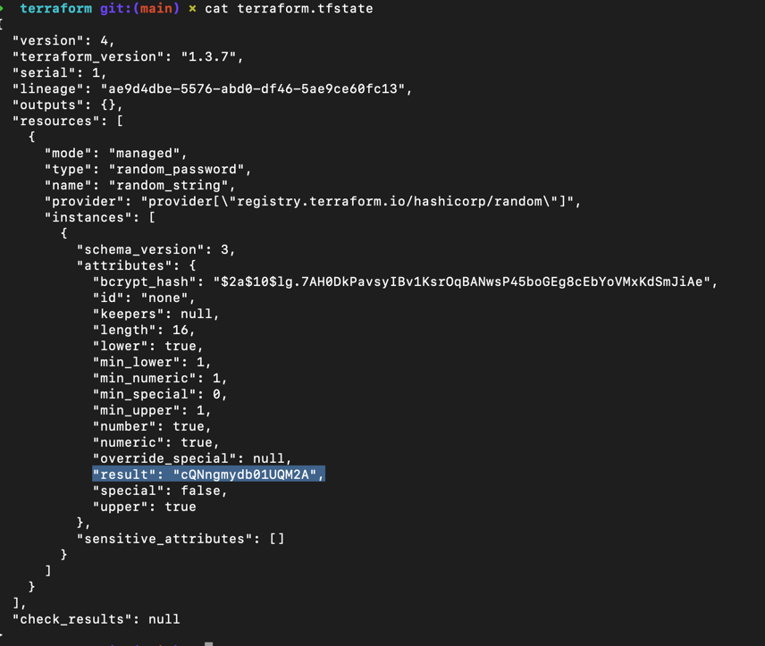
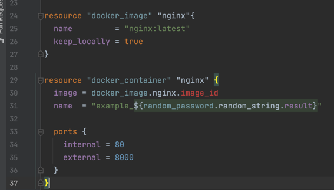
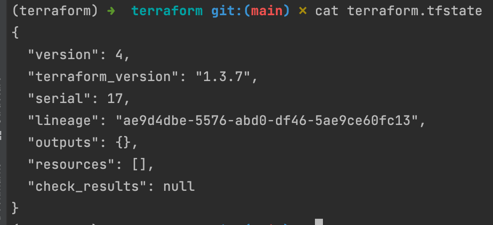

### 1.Задание 1
Перейдите в каталог src. Скачайте все необходимые зависимости, использованные в проекте.  
- Изучите файл .gitignore. В каком terraform файле допустимо сохранить личную, секретную информацию?  
>personal.auto.tfvars

- Выполните код проекта. Найдите в State-файле секретное содержимое созданного ресурса random_password. Пришлите его в качестве ответа.     
>
- Раскомментируйте блок кода, примерно расположенный на строчках 29-42 файла main.tf. Выполните команду terraform -validate. Объясните в чем заключаются намеренно допущенные ошибки? Исправьте их.  
> Ошибка в блоках "type" "name". В первом случае в отсутствии блока "name" а во втором в неправильном написании имени  
> 
- Выполните код. В качестве ответа приложите вывод команды docker ps
> 
- Замените имя docker-контейнера в блоке кода на hello_world, выполните команду terraform apply -auto-approve. Объясните своими словами, в чем может быть опасность применения ключа -auto-approve ?
> ну судя повсему эта команда пропускает все проверки и сразу разворачивает все что написанно в инструкции. Чревато тем что можно пропустить что-то важное и потом прйдется заново все запускать.
- Уничтожьте созданные ресурсы с помощью terraform. Убедитесь, что все ресурсы удалены. Приложите содержимое файла terraform.tfstate.  
> 
- Объясните, почему при этом не был удален docker образ nginx:latest ?(Ответ найдите в коде проекта или документации) 
>  keep_locally = true