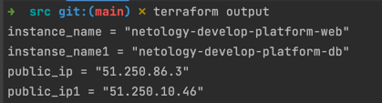

### Задание 1
-   

- 
- preemptible - Указывает, является ли экземпляр вытесняемым. Если для этого поля установлено значение true, то automatic_restartдолжно быть установлено значение false. По умолчанию ложно.
- core_fraction - Если указано, указывает базовую производительность ядра в процентах.

### Задание 2
- 
### Задание 3
- 
### Задание 4
- 
### Задание 5
- не совсем понял задание но для примера можно сделать вот так:  
- 
### Задание 6
- 
- 