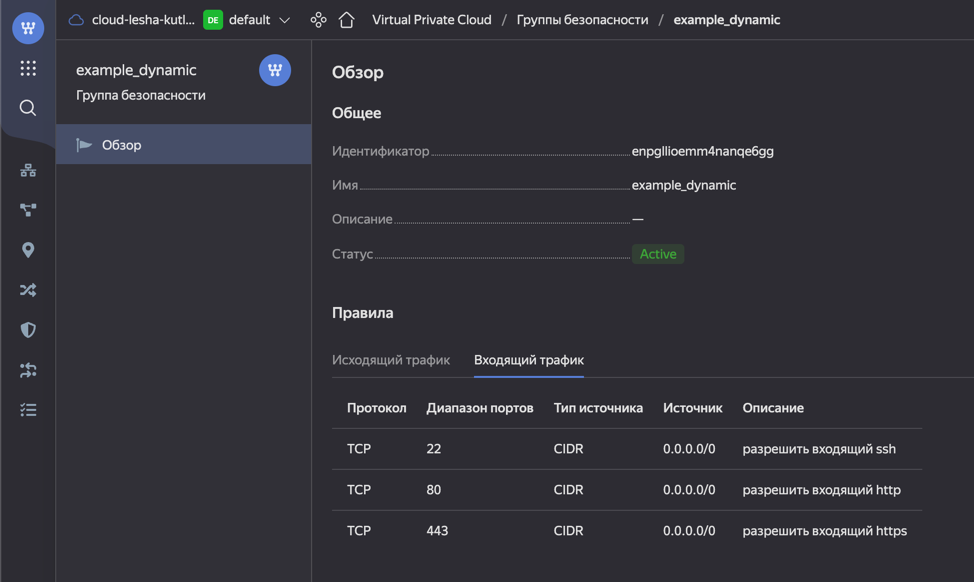

### 1. Задание 1.

### 2. Задание 2.
2.1
```terraform
resource "yandex_vpc_network" "develop" {
  name = var.vpc_name
}
resource "yandex_vpc_subnet" "develop" {
  name           = var.vpc_name
  zone           = var.default_zone
  network_id     = yandex_vpc_network.develop.id
  v4_cidr_blocks = var.default_cidr
}
data "yandex_compute_image" "ubuntu" {
  family = "ubuntu-2004-lts"
}
resource "yandex_compute_instance" "web" {
  count       = 2
  name        = "netology-develop-platform-web-${count.index}"
  platform_id = "standard-v1"
  resources {
    cores  = 2
    memory = 2
  }
  boot_disk {
    initialize_params {
      image_id = data.yandex_compute_image.ubuntu.image_id
    }
  }
  network_interface {
    subnet_id = yandex_vpc_subnet.develop.id
    nat       = true
  }
}
````
2.2
```terraform

resource "yandex_vpc_network" "develop1" {
  name = var.vpc_name1
}
resource "yandex_vpc_subnet" "develop1" {
  name           = var.vpc_name1
  zone           = var.default_zone
  network_id     = yandex_vpc_network.develop1.id
  v4_cidr_blocks = var.default_cidr
}
data "yandex_compute_image" "ubuntu1" {
  family = "ubuntu-2004-lts"
}

#этот блок не получается
resource "yandex_compute_instance" "vm" {
  for_each    = toset(var.vm_names)
  name        = each.value
  platform_id = "standard-v1"
  resources {

  }
  boot_disk {
    initialize_params {
      image_id = data.yandex_compute_image.ubuntu1.image_id
    }
  }
  network_interface {
    subnet_id = yandex_vpc_subnet.develop1.id
    nat       = true
  }

}
```
#дальше не делал еще